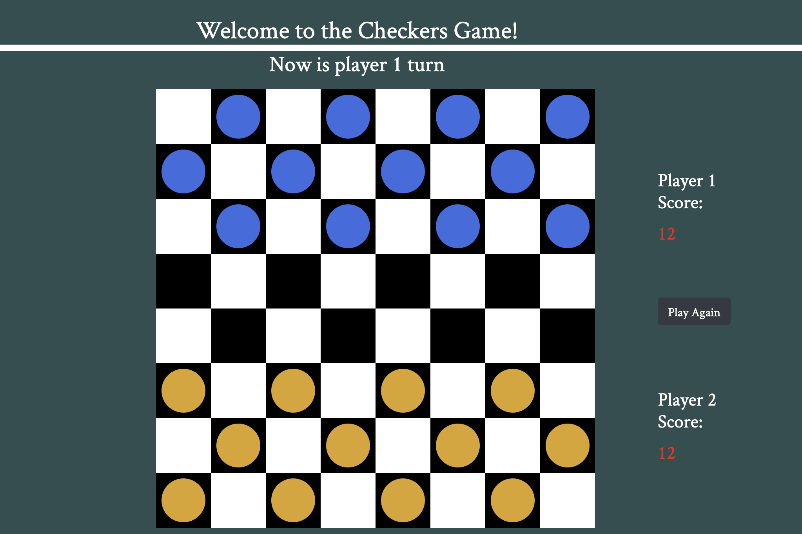

# Checkers Game 

## Game Rules

Single pieces are always limited to forward moves (toward the opponent). A piece making a non-capturing move (not involving a jump) may move only one square. A piece making a capturing move (a jump) leaps over one of the opponent's pieces, landing in a straight diagonal line on the other side

### Technologies Used

Html / CSS / JavaScript

### Play Game

[Click link to play a game](https://amir9499-99.github.io/Checkers-Game/)
